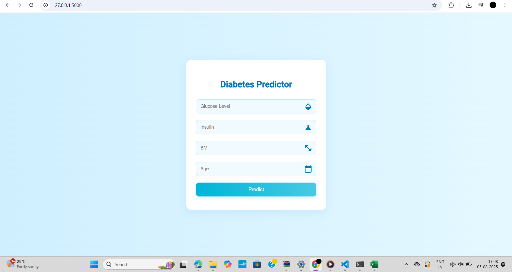

# Diabetes Predictor
Predict Diabetes using Machine Learning.

This project aims to predict whether a patient has diabetes based on key features such as Glucose level, Insulin, Age, and BMI.

We carry out every step from data gathering to model deployment. During the model evaluation phase, multiple machine learning algorithms are compared using the accuracy_score metric to identify the best-performing model.

Finally, a web application is developed using Flask, a Python micro-framework, to make the model accessible and easy to use.

# Screenshot

# Installation

- Clone this repository and unzip it.

- After downloading, `cd` and put path of the folder

- Begin a new virtual environment with Python and activate it.

- Install the required packages using 
   `pip install -r requirements.txt`

- Execute the command:
   `python app.py`

- Open http://127.0.0.1:5000/ in your browser.
